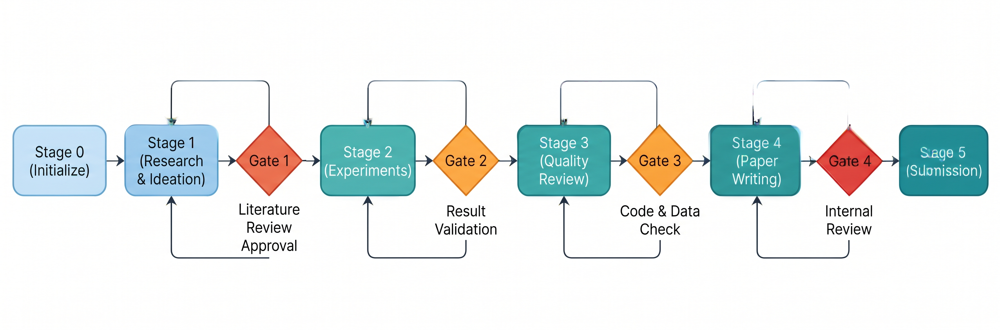
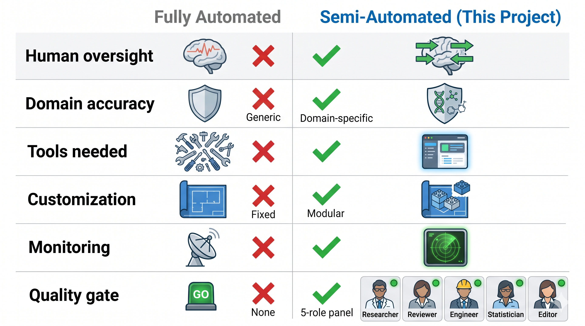
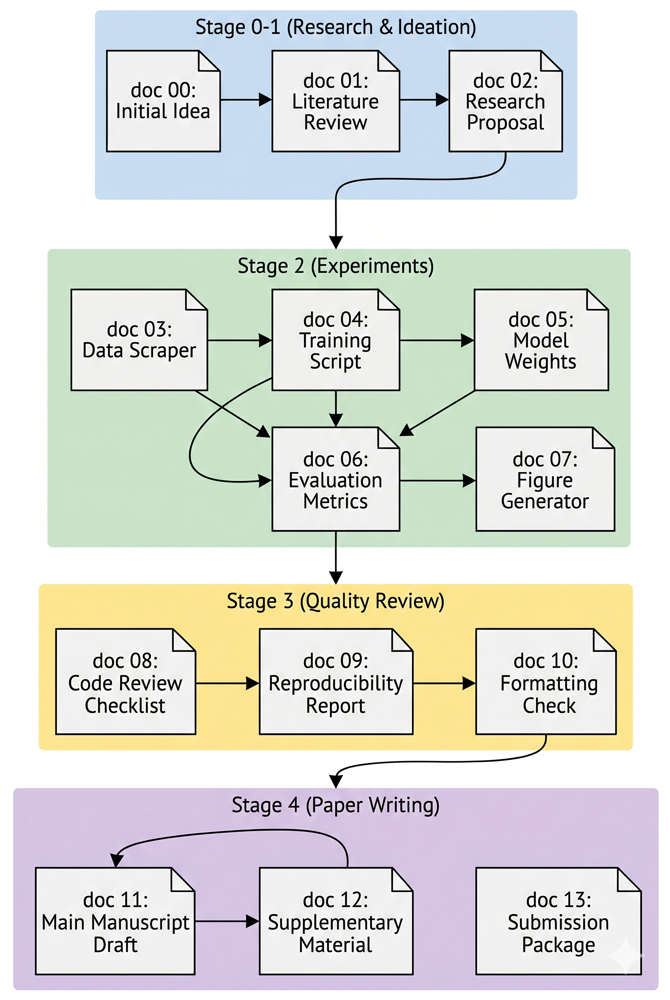

# DL Research Workflow

[English](README.md) | [中文](README_CN.md)

> A semi-automated deep learning research workflow for Claude Code — from literature review to paper submission, with human expert checkpoints at every critical decision.



## Why This Project?

Fully automated AI research tools promise end-to-end paper generation, but they fail in domain-specific scenarios where expert judgment is critical. This workflow takes a different approach: **human-in-the-loop checkpoints** at every decision point, with AI handling the repetitive work in between.

### Comparison with Existing Approaches



| Feature               | Fully Automated (AI Scientist, etc.) | This Workflow                                          |
| --------------------- | ------------------------------------ | ------------------------------------------------------ |
| Human oversight       | Minimal — AI decides everything     | **4 mandatory checkpoints** with expert review   |
| Domain accuracy       | Generic — hallucination-prone       | Domain-specific prompts + adversarial review           |
| Tool requirements     | Multiple APIs, platforms, accounts   | **Single tool** (Claude Code, Codex, or similar) |
| Customization         | Fixed pipeline                       | 26 modular skills — swap, extend, remove              |
| Experiment monitoring | External (W&B, MLflow)               | Built-in background monitoring — zero context growth  |
| Paper quality gate    | None or simple threshold             | 5-role reviewer panel + critic                         |

### Two Key Advantages

**1. Human Correction Checkpoints**

Unlike fully automated pipelines that run unsupervised, this workflow enforces 4 mandatory gates where domain experts review and correct AI decisions:

| Checkpoint | When                      | What's Reviewed                             |
| ---------- | ------------------------- | ------------------------------------------- |
| Gate 1     | Before opening GPU server | Idea novelty + experiment plan completeness |
| Gate 2     | Before writing paper      | Result quality + claim-evidence alignment   |
| Gate 3     | Before LaTeX drafting     | Outline structure + contribution clarity    |
| Gate 4     | Before submission         | Full draft quality audit                    |

Each gate prevents low-quality work from propagating downstream. A rejected gate routes back to the appropriate stage — no wasted compute or writing effort.

**2. Single-Tool Execution**

No API keys to manage. No platform accounts to create. No external services to configure.

The entire workflow runs inside a single AI coding assistant. Literature search uses MCP servers (arXiv, Semantic Scholar, OpenAlex) — configured once and available across projects.

---

## Workflow Overview

```
Stage 0: Initialize          → Project scaffold + venue selection
Stage 1: Research + Ideation → Literature → Ideas → Novelty check → Experiment plan
         ──── Gate 1 ────
Stage 2: Experiments         → Code implementation → Training → Result analysis
         ──── Gate 2 ────
Stage 3: Quality Review      → Statistical analysis → Claim validation → Score ≥ 6
         ──── Gate 3 ────
Stage 4: Paper Writing       → Outline → Figures → LaTeX → Audit loop
         ──── Gate 4 ────
Stage 5: Submission Prep     → Cover letter → Highlights → Final check
```

## Document Flow



The workflow generates 14 structured documents (`docs/00` through `docs/13`) tracing the complete research narrative from venue selection to final submission.

## 26 Core Skills

| Group              | Skills                                                                                                                      | Purpose                                                                        |
| ------------------ | --------------------------------------------------------------------------------------------------------------------------- | ------------------------------------------------------------------------------ |
| Review (always-on) | `academic-paper-reviewer` `research-review`                                                                             | 5-role panel + critic                                                          |
| Scaffold           | `pl-ml-project-template`                                                                                                  | PyTorch Lightning project generator                                            |
| Idea Chain         | `idea-discovery` `research-lit` `idea-creator` `novelty-check` `research-refine`                                  | Literature → brainstorm → validate → refine                                 |
| Experiment         | `experiment-plan` `ablation-planner` `experiment-bridge` `run-experiment` `pytorch-lightning` `result-to-claim` | Plan → implement → run → evaluate                                           |
| Monitoring         | `auto-monitor`                                                                                                            | Background experiment monitoring                                               |
| Analysis           | `auto-review-loop` `analyze-results`                                                                                    | Iterative quality scoring + statistics                                         |
| Figures            | `paper-figure` `scientific-visualization` `scientific-figure-making` `paper-illustration`                           | Data plots + publication figures + matplotlib patterns + architecture diagrams |
| Writing            | `paper-plan` `paper-write` `paper-compile` `humanizer` `paper-audit`                                              | Outline → draft → compile → de-AI → audit                                  |

### Skill Attribution

Most skills are adapted from community open-source projects with modifications for this workflow's document handoff protocol. Two skills are original to this project.

| Source                      | Skills                                                  | Notes                                                                                                                       |
| --------------------------- | ------------------------------------------------------- | --------------------------------------------------------------------------------------------------------------------------- |
| **Original**          | `auto-monitor` `pl-ml-project-template`             | Built from scratch for this project                                                                                         |
| **Community adapted** | All other 24 skills (incl.`scientific-figure-making`) | Sourced from various Claude Code skill repositorie. All modified for inter-skill document handoffs and pipeline integration |

---

## Quick Start

### Prerequisites

- [Claude Code](https://claude.ai/code) (or any compatible AI coding assistant)
- [uv](https://docs.astral.sh/uv/) (Python package installer, for arxiv & semanticscholar MCP)
- [Node.js](https://nodejs.org/) (for openalex MCP)
- GPU server with SSH access (for training)

### Setup

1. Clone this repo:

```bash
git clone https://github.com/wangyi0403/dl-research-workflow.git
```

2. Install MCP servers for literature search:

```bash
# arXiv — search & download papers (no API key needed)
uv tool install arxiv-mcp-server

# Semantic Scholar — published paper search (API key optional, recommended)
uv tool install semantic-scholar-mcp
# Optional: get API key at https://www.semanticscholar.org/product/api

# OpenAlex — open academic data (no API key needed)
npm install -g openalex-mcp
```

3. Copy config files and skills into your research project (project-level, no global install):

```bash
# Linux / macOS
cd your-project
cp /path/to/dl-research-workflow/CLAUDE.md .
cp /path/to/dl-research-workflow/SETUP.md .
cp /path/to/dl-research-workflow/.mcp.json .
mkdir -p .claude/skills
cp -r /path/to/dl-research-workflow/skills/* .claude/skills/

# Windows (PowerShell)
Set-Location your-project
Copy-Item \path\to\dl-research-workflow\CLAUDE.md .
Copy-Item \path\to\dl-research-workflow\SETUP.md .
Copy-Item \path\to\dl-research-workflow\.mcp.json .
New-Item -ItemType Directory -Path ".claude\skills" -Force
Copy-Item -Path "\path\to\dl-research-workflow\skills\*" -Destination ".claude\skills\" -Recurse
```

All 26 skills live inside the project's `.claude/skills/` — no global installation needed. Each research project is fully self-contained.

4. Edit `CLAUDE.md` — fill in your server config (SSH host, port, venue, journals).
5. (Optional) Set environment variables for higher API rate limits:

```bash
# Semantic Scholar (higher rate limits)
export SEMANTIC_SCHOLAR_API_KEY="your-key"
# OpenAlex (100 req/s instead of 10)
export OPENALEX_DEFAULT_EMAIL="your@email.com"
```

6. Open your project in Claude Code and say:

```
新建项目 timeseries
```

The scaffold skill generates the project structure. Follow `SETUP.md` to load all skills.

### Model Routing (Cost Optimization)

| Tier      | Model  | When to Use                                                                |
| --------- | ------ | -------------------------------------------------------------------------- |
| Strongest | Opus   | Idea novelty judgment, contribution definition, reviewer role, paper-audit |
| Standard  | Sonnet | Most writing, code implementation, experiment-bridge                       |
| Cheapest  | Haiku  | Citation formatting, log parsing, template filling                         |

## Venue Support

| Venue Type          | Supported Features                           |
| ------------------- | -------------------------------------------- |
| Elsevier (DC/SC)    | Highlights, Graphical Abstract, Cover Letter |
| IEEE (Journal/Conf) | IEEEtran formatting                          |
| NeurIPS / ICLR      | Reproducibility Checklist, Supplementary PDF |
| ICML                | Ethics Statement, Reproducibility Statement  |

## File Structure

```
.
├── CLAUDE.md          # Project-level AI instructions (copy to your project)
├── SETUP.md           # Setup guide + document specs (copy to your project)
├── .mcp.json          # Project-level MCP config: arxiv + semanticscholar + openalex
├── skills/            # 26 core skills
│   ├── academic-paper-reviewer/
│   ├── auto-monitor/
│   ├── idea-discovery/
│   ├── paper-audit/
│   ├── ...
│   └── run-experiment/
├── diagram/           # Architecture and flow diagrams
└── README.md
```

---

## License

MIT License — see [LICENSE](LICENSE).
