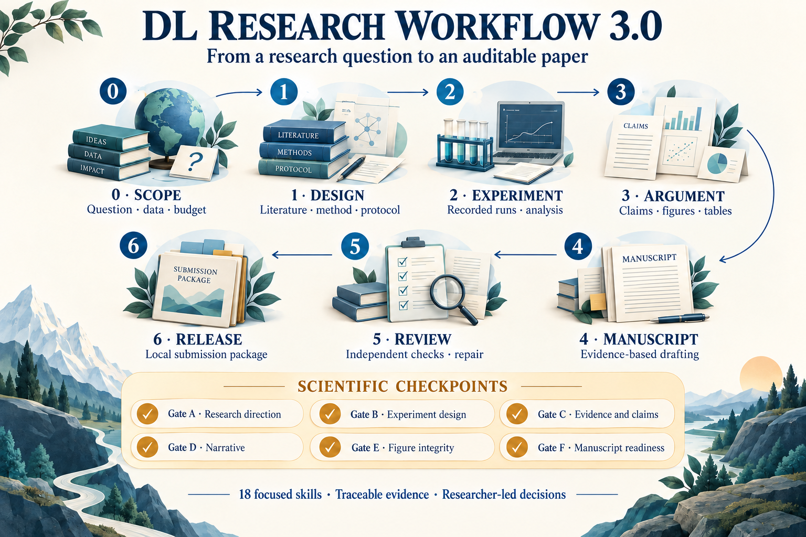
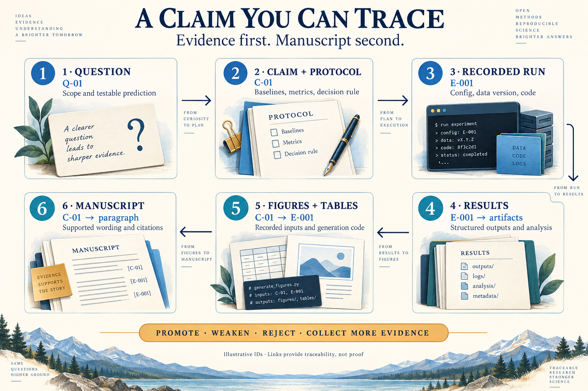

# DL Research Workflow 3.0

**From a research question to an auditable paper.**

[English](README.md) | [简体中文](README_CN.md)

[Quick start](#start-here) · [Workflow](docs/WORKFLOW_EN.md) · [Design comparison](docs/COMPARISON.md)


A portable, evidence-driven research workspace for AI agents. Organize questions, methods, experiments, results, figures and manuscripts in one project, with human scientific judgment at the decisions that matter.

**18 focused skills · Stage 0–6 · Gate A–F · traceable experiments · bilingual guides**



*Overview illustration; checkpoint placement and conditional paths follow the [workflow guide](docs/WORKFLOW_EN.md).*

## Why use it?

- **Keep the evidence connected.** Link each claim to its experiments, result tables, figures, citations and manuscript location.
- **Make experiments recoverable.** Record immutable run identities, configurations, logs and terminal states; build tables from the declared run set.
- **Review the right uncertainty.** Separate script checks, scientific review and author decisions. Recheck the gates affected by a change.
- **Use the assistant you already have.** Shared `AGENTS.md`, a Claude Code entry point and a generic startup prompt; project-local adapters keep the workflow portable.
- **Load what the current stage needs.** Choose research, writing, figures or release profiles rather than install a broad global skill collection.
- **Keep the research yours.** The researcher owns the question, evidence interpretation, manuscript and publishing decision. AI supports the work and does not certify its validity.

## Start here

Download or clone this repository. Use Python 3.10+ and run these commands **from the distribution checkout**. The initializer uses only the standard library and creates a separate study outside this checkout.

```bash
python tools/project.py init ../my-study --agent generic --profile research --dry-run
python tools/project.py init ../my-study --agent generic --profile research
python tools/project.py check ../my-study
```

Choose the `--agent` value for your assistant:

| Assistant | Value | Open `my-study` and use |
|---|---|---|
| Codex | `codex` | `AGENTS.md` + project `.agents/skills/` |
| Claude Code | `claude` | `CLAUDE.md` + generated `.claude/skills/` copies |
| DeepSeek Harness | `dsh` | Explicitly provide `AI_START.md` and the relevant skill files |
| ZCode | `zcode` | Workspace `AGENTS.md`; explicit skill reading or project-scoped import |
| Other file-capable agents | `generic` | The startup prompt below and explicit file reading |

**Paste into your assistant after opening the new project:**

```text
Read AGENTS.md, AI_START.md and docs/00_start.md in this workspace.
Use English for our conversation unless I request another language.
First identify the current stage, existing evidence and missing decisions.
For a new study, help me define the question, data boundaries, success
criteria and budget. Load only the relevant stage and skill files.
Propose and complete the next useful action within the agreed scope;
report actual outputs and verification. Do not treat missing checks as passes.
```

Later, run `python tools/project.py add ../my-study --profile writing figures` **from the complete distribution**. Omitting `--agent` preserves the project's existing adapter. Use `--profile full` at initialization if you want all 18 skills now.

[Profiles, existing-project safety and dependencies](SETUP.md) · [Agent compatibility and official sources](docs/AGENT_COMPATIBILITY.md). The adapters supply files; live native discovery and tool use depend on the host. Detailed shared stage records are currently Chinese; the English workflow guide explains their purpose and IDs.

## One evidence chain, seven stages

| Stage | Work | Main records / checkpoint |
|---|---|---|
| 0 | Define scope, data access, budget and ownership | `docs/00_start.md` |
| 1 | Audit data; investigate literature; refine questions, methods and experiments | `docs/01`–`05`, Gates A/B |
| 2 | Execute recorded runs; analyze results and update claims | `experiments/registry`, `docs/06`–`08`, Gate C |
| 3 | Design the argument, figures and tables | `docs/09`–`10`, Gates D/E |
| 4 | Draft and check the manuscript against its evidence | `paper/`, `docs/11`, Gate F |
| 5 | Review and repair scientific or presentation issues | Versioned review findings and actual revisions |
| 6 | Prepare a reviewable submission/release package | `docs/12_release_readiness.md` |

The full numbered record filenames are listed in [the document index](docs/README_EN.md). A completed folder or successful script run is not a scientific gate pass.

### Follow a claim back to its evidence



The IDs shown are illustrative. Actual claims must resolve to the project’s recorded runs and artifacts; a link alone does not establish scientific validity.

## How this differs from other research-agent projects

Developed through research practice, this template draws on design experience from Nature Skills, K-Dense, AI Research Skills, Academic Research Skills, and automated research/literature-review projects. It organizes those patterns into a researcher-led chain: **question → protocol → recorded run → evidence → figures → manuscript**, supported by Stage 0–6, Gate A–F and persistent records.

| Design influence | Pattern considered | How this template organizes it |
|---|---|---|
| [AI Scientist-v2](https://github.com/SakanaAI/AI-Scientist-v2) | Autonomous research and experimental iteration | Stage-based progress with budgets, stop rules and checked artifacts |
| [Agent Laboratory](https://github.com/SamuelSchmidgall/AgentLaboratory) | Literature–experiment–report role collaboration | Handoffs carry question, claim and run IDs; the lead agent verifies integration |
| [AI-Researcher](https://github.com/HKUDS/AI-Researcher) | Connecting ideas, research execution and manuscripts | Persistent project records across stages, with replaceable tools and researcher decisions |
| [AI Research Skills](https://github.com/Orchestra-Research/AI-Research-SKILLs) | Reusable research skills and ideation lenses | 18 focused skills organized around Stage 0–6 and Gate A–F; question-quality references retain attribution |
| [K-Dense Scientific Agent Skills](https://github.com/K-Dense-AI/scientific-agent-skills) | Systematic literature workflows, citation checks and scientific visualization | Literature supports testable claims; figures trace to recorded runs and data without requiring the whole library |
| [Nature Skills](https://github.com/Yuan1z0825/nature-skills) | Structured literature processing, academic expression and figure workflows | Literature, claims, figures and manuscripts connect through shared stage records and checks |
| [Academic Research Skills](https://github.com/Imbad0202/academic-research-skills) | Research–writing–review–revision loops | Review findings bind to manuscript versions; repairs recheck affected gates |
| [PaperOrchestra](https://github.com/Ar9av/PaperOrchestra) | Skill-based paper pipelines and quality assessment | Review perspectives follow the actual risk, with evidence and completed repairs as acceptance criteria |

Literature-workflow influences also include Research Literature Review, AIPOCH Systematic Review, Medical Imaging Review and Research Superpower. See the [full design comparison](docs/COMPARISON.md) for each mapping.

These are design influences and implementation emphases. **Design influence, adapted material and bundled code are distinct relationships.** See [sources and distribution scope](docs/ECOSYSTEM.md) for the 18-skill boundary and [NOTICE](NOTICE.md) for adapted-material attribution. This is not a measured ranking of scientific or manuscript quality.

## What's included

```text
.
├── AGENTS.md / CLAUDE.md / AI_START.md  # Shared rules and assistant entry points
├── skill-manifest.json                 # Version, profiles and support dependencies
├── .agents/skills/                     # 18 core skills with references and scripts
├── .agenthub/runtime/                  # Paper-audit support; not an extra skill
├── docs/                              # 00–12 records, workflow and writing guidance
├── data/                              # Project data, with restricted/raw exclusions
├── experiments/                       # Configurations, source, runner contracts and registry
├── results/                           # Traceable structured outputs, figures and tables
├── paper/                             # Manuscripts and local submission materials
├── resources/                         # Workflow/organization figures and editable sources
└── tools/                             # Portable initializer, checks and regression tests
```

## Practical boundaries

Adapters supply files and instructions; they do not guarantee every assistant's tool execution, scheduling or native skill discovery. Actual capabilities depend on your selected agent. Optional plotting/audit features list their own dependencies, and missing checks remain explicit rather than passed. No credentials, research data or global MCP configuration are bundled.

Researcher approval is required for external publication, paid compute, data sharing and final scientific claims. Configure those boundaries in `docs/00_start.md`.

MIT for this project's material; preserve the third-party notices in [NOTICE.md](NOTICE.md) and `licenses/`.
