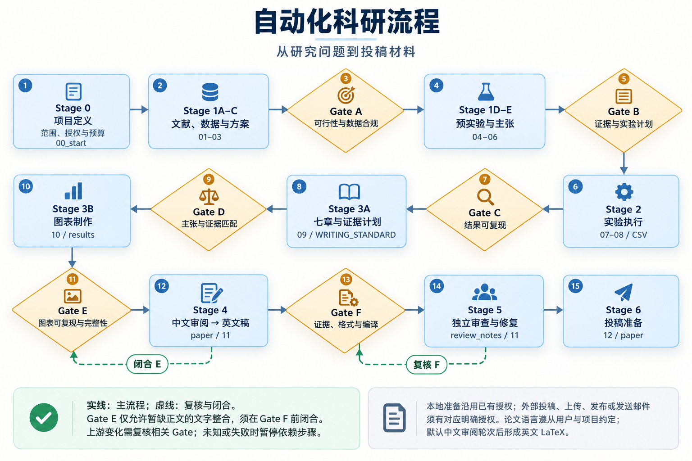

# DL Research Workflow 3.0

**从研究问题，到证据可追溯的论文。**

[English](README.md) · [简体中文](README_CN.md) · [快速开始](SETUP_CN.md) · [完整流程](docs/WORKFLOW.md) · [设计对比](docs/COMPARISON_CN.md)


把文献、研究问题、方法、实验、结果、图表与稿件放进同一个项目，让 AI 助手承担可核对的工作，让研究者在关键科学判断上保持主导。

**18个核心技能 · Stage 0–6 · Gate A–F · 可追溯实验 · 中英文指南**



## 这套模板解决什么问题？

- **论断与证据接得上。** 每项研究判断关联实验、结果表、图、引用与稿件位置。
- **实验过程找得回。** 不可变运行身份、配置、日志与终态进入统一台账；按预先约定的运行集合生成结果表。
- **审查能推动修复。** 程序检查、科学审阅与作者决定分别记录；变化后只重新检查受影响的 Gate。
- **复用已有助手。** 使用通用 `AGENTS.md`、Claude Code 入口及显式启动提示，技能和支持脚本保存在项目内。
- **按阶段加载能力。** 可分别选择研究、写作、绘图和发布准备，不需要先装一套全局工具市场。
- **研究者掌握方向。** 科学问题、证据解释、稿件和发布决定由研究者负责；AI 辅助执行，不承担科学签认。

## 快速开始

下载本仓库，或从 GitHub 的 **Code** 菜单复制仓库地址进行克隆。使用 Python 3.10 及以上版本；初始化和结构检查只依赖 Python 标准库。

```bash
cd dl-research-workflow
python tools/project.py check .
python tools/project.py init ../my-study --agent codex --profile research --dry-run
python tools/project.py init ../my-study --agent codex --profile research
```

Claude Code 使用 `--agent claude`，会额外生成其原生 `.claude/skills/` 副本。其他能读取项目文件的助手使用 `--agent generic`，显式提供 [AI_START.md](AI_START.md)。

DeepSeek Harness、ZCode分别提供 `--agent dsh` / `--agent zcode` 文件契约预设。[兼容说明](docs/AGENT_COMPATIBILITY.md)区分有官方文档依据的入口和仍需实际环境核验的集成行为。

在新项目中告诉助手：

> 先读 `AGENTS.md`、`AI_START.md` 和 `docs/00_start.md`。帮我明确研究问题、数据边界、成功标准与预算，根据当前阶段决定下一步。

研究进入写作、绘图阶段后再补充：

```bash
python tools/project.py add ../my-study --agent codex --profile writing figures
python tools/project.py check ../my-study
```

已有研究沿用现有证据、成果与状态；初始化器在发现不同内容时停止，不覆盖已有项目。[完整安装说明](SETUP_CN.md)

## 七个阶段，一条证据链

| 阶段 | 工作 | 主要记录 / 检查点 |
|---|---|---|
| 0 | 定义范围、数据访问、预算和决策边界 | `docs/00_start.md` |
| 1 | 数据审计、文献与选题、方法和实验设计 | `docs/01`–`05`，Gate A/B |
| 2 | 执行实验、分析结果、更新论断 | 实验台账、`docs/06`–`08`，Gate C |
| 3 | 组织论文论证、图与表 | `docs/09`–`10`，Gate D/E |
| 4 | 基于证据写作与核验稿件 | `paper/`、`docs/11`，Gate F |
| 5 | 科学审阅与实际修复 | 带版本的审查问题和修订记录 |
| 6 | 准备可审阅的投稿 / 发布包 | `docs/12_release_readiness.md` |

完整记录位置见 [文档索引](docs/README.md)。目录齐全、脚本运行成功和科学 Gate 通过是不同的完成条件。

## 与已有项目有什么区别？

| 项目 / 设计 | 主要侧重 | 本模板的侧重 |
|---|---|---|
| [AI Scientist-v2](https://github.com/SakanaAI/AI-Scientist-v2) | 借助 Agent 树搜索进行自主科研探索 | 在研究者主导的项目内，让已有助手按阶段和证据推进 |
| [Agent Laboratory](https://github.com/SamuelSchmidgall/AgentLaboratory) | 专门 Agent 支持文献、实验和报告，容纳人工参与 | 研究问题、论断、运行和稿件之间的持久记录与定点审查 |
| [AI-Researcher](https://github.com/HKUDS/AI-Researcher) | 一体化自主科研流程 | 可移植项目模板、可替换工具及明确的项目决定 |
| [AI Research Skills](https://github.com/Orchestra-Research/AI-Research-SKILLs) | 广泛科研 / 工程技能与调度层 | 围绕 Stage 0–6、Gate A–F 和阶段记录组织18个核心技能 |

本模板把实验迭代、材料组织、按需读取和人工审查等实践思路落实为可检查的项目结构。上表比较设计侧重，不代表经过统一实验验证的论文质量排名。详见 [设计对比](docs/COMPARISON_CN.md) 与 [来源说明](NOTICE.md)。

## 仓库内容

```text
.
├── AGENTS.md / CLAUDE.md / AI_START.md  # 通用规则与助手入口
├── skill-manifest.json                 # 版本、profile与运行支持
├── .agents/skills/                     # 18个核心技能、参考与脚本
├── .agenthub/runtime/                  # 稿件审计支持，不计为额外技能
├── docs/                              # 00–12记录、流程与写作规范
├── data/                              # 数据；原始/受限数据默认不提交
├── experiments/                       # 配置、实现、运行契约与台账
├── results/                           # 可追溯结果、图与表
├── paper/                             # 稿件与本地投稿材料
├── resources/                         # 流程、目录图与可编辑源文件
└── tools/                             # 可移植初始化、检查与回归验证
```

## 使用边界

适配器提供目录和读取入口，各助手的工具调用、监督调度及原生技能发现需要在实际环境中核验。绘图或稿件审计的可选依赖按功能安装；缺失检查明确记录，不能当作通过。本仓库不包含凭据、实际研究数据或全局 MCP 配置。

外部发布、付费计算、数据共享和最终科学结论需要研究者确认；项目边界写入 `docs/00_start.md`。项目材料采用 MIT，第三方来源及许可保留在 [NOTICE.md](NOTICE.md) 与 `licenses/`。
