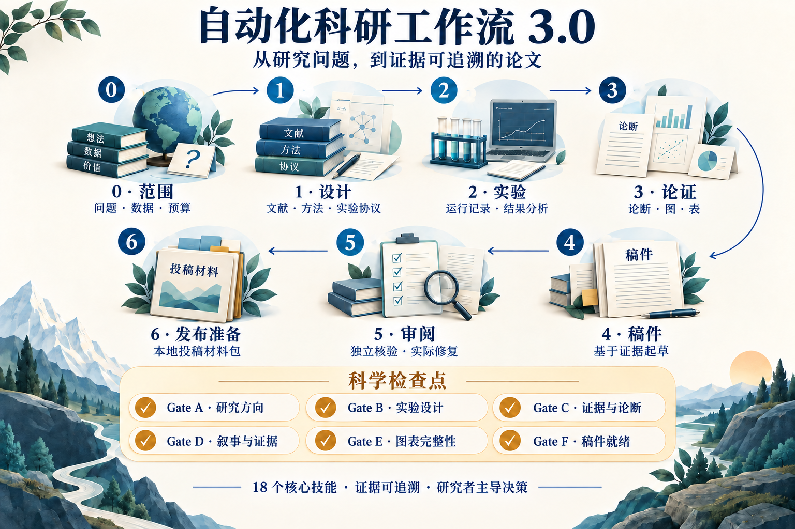
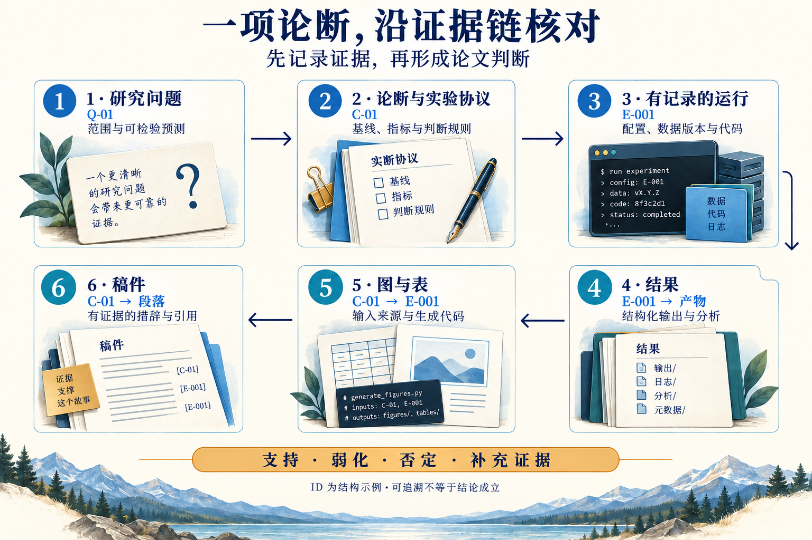

# DL Research Workflow 3.0

**从研究问题，到证据可追溯的论文。**

[English](README.md) | [简体中文](README_CN.md)

[快速开始](#快速开始) · [完整流程](docs/WORKFLOW.md) · [设计对比](docs/COMPARISON_CN.md)


把文献、研究问题、方法、实验、结果、图表与稿件放进同一个项目，让 AI 助手承担可核对的工作，让研究者在关键科学判断上保持主导。

**18个核心技能 · Stage 0–6 · Gate A–F · 可追溯实验 · 中英文指南**



*本图为流程概览；检查点位置与条件路径以[工作流规则](docs/WORKFLOW.md)为准。*

## 这套模板解决什么问题？

- **论断与证据接得上。** 每项研究判断关联实验、结果表、图、引用与稿件位置。
- **实验过程找得回。** 不可变运行身份、配置、日志与终态进入统一台账；按预先约定的运行集合生成结果表。
- **审查能推动修复。** 程序检查、科学审阅与作者决定分别记录；变化后只重新检查受影响的 Gate。
- **复用已有助手。** 使用通用 `AGENTS.md`、Claude Code 入口及显式启动提示，技能和支持脚本保存在项目内。
- **按阶段加载能力。** 可分别选择研究、写作、绘图和发布准备，不需要先装一套全局工具市场。
- **研究者掌握方向。** 科学问题、证据解释、稿件和发布决定由研究者负责；AI 辅助执行，不承担科学签认。

## 快速开始

下载或克隆本仓库，使用 Python 3.10+。**从发布仓库目录**执行以下命令，在仓库之外创建独立研究项目；初始化仅依赖标准库。

```bash
python tools/project.py init ../my-study --agent generic --profile research --dry-run
python tools/project.py init ../my-study --agent generic --profile research
python tools/project.py check ../my-study
```

按所用助手替换 `--agent` 的值：

| 助手 | 参数值 | 打开 `my-study` 后使用 |
|---|---|---|
| Codex | `codex` | `AGENTS.md` 与项目 `.agents/skills/` |
| Claude Code | `claude` | `CLAUDE.md` 与生成的 `.claude/skills/` 副本 |
| DeepSeek Harness | `dsh` | 显式提供 `AI_START.md` 与当前技能文件 |
| ZCode | `zcode` | 工作区 `AGENTS.md`；显式读技能或选择项目级导入 |
| 其他可读项目文件的助手 | `generic` | 下方启动提示词，显式读取项目文件 |

**打开新项目后，直接把这段话发给助手：**

```text
读取当前工作区的 AGENTS.md、AI_START.md 和 docs/00_start.md。
使用简体中文交流；论文语言按本项目约定。
先确认当前阶段、已有证据和缺失的关键决定。
新项目先帮我明确研究问题、数据边界、成功标准和预算。
只加载当前阶段与相关技能；在已约定范围内提出并完成下一项有用工作。
报告实际产物与核验结果，不把缺失检查当作通过。
```

后续**从完整发布仓库**运行 `python tools/project.py add ../my-study --profile writing figures`。省略 `--agent` 会沿用项目原适配方式；如希望一开始装齐18项技能，初始化时选择 `--profile full`。

[分组、已有项目保护及依赖说明](SETUP_CN.md) · [兼容边界与官方依据](docs/AGENT_COMPATIBILITY.md)。适配器提供文件入口，原生技能发现和实际工具调用取决于宿主。

## 七个阶段，一条证据链

| 阶段 | 工作 | 主要记录 / 检查点 |
|---|---|---|
| 0 | 定义范围、数据访问、预算和决策边界 | `docs/00_start.md` |
| 1 | 数据审计、文献与选题、方法和实验设计 | `docs/01`–`05`，Gate A/B |
| 2 | 执行实验、分析结果、更新论断 | 实验台账、`docs/06`–`08`，Gate C |
| 3 | 组织论文论证、图与表 | `docs/09`–`10`，Gate D/E |
| 4 | 基于证据写作与核验稿件 | `paper/`、`docs/11`，Gate F |
| 5 | 科学审阅与实际修复 | 带版本的审查问题和修订记录 |
| 6 | 准备可审阅的投稿 / 发布包 | `docs/12_release_readiness.md` |

完整记录位置见 [文档索引](docs/README.md)。目录齐全、脚本运行成功和科学 Gate 通过是不同的完成条件。

### 从论文论断追溯实际证据



图中 ID 为结构示例。实际论断必须关联本项目真实运行和产物；建立链接本身不代表科学结论成立。

## 与已有项目有什么区别？

这套模板在科研实践中借鉴了 Nature Skills、K-Dense、AI Research Skills、Academic Research Skills，以及自动化研究和文献综述项目的设计经验。它把这些经验组织成研究者主导的项目流程：**问题 → 实验协议 → 实际运行 → 证据 → 图表 → 稿件**，由 Stage 0–6、Gate A–F 和统一记录承接。

| 设计借鉴来源 | 借鉴的侧重 | 在本模板中的组织方式与区别 |
|---|---|---|
| [AI Scientist-v2](https://github.com/SakanaAI/AI-Scientist-v2) | 自主研究与实验迭代 | 把探索推进落实为有预算、停止条件与产物核验的阶段流程 |
| [Agent Laboratory](https://github.com/SamuelSchmidgall/AgentLaboratory) | 文献—实验—报告的角色协作 | 交接携带问题、论断和运行 ID，主控核验后整合 |
| [AI-Researcher](https://github.com/HKUDS/AI-Researcher) | 连接选题、研究执行与论文的端到端流程 | 用项目内记录接续全流程，保留工具替换和研究者决定 |
| [AI Research Skills](https://github.com/Orchestra-Research/AI-Research-SKILLs) | 可复用科研技能与研究构思视角 | 围绕 Stage 0–6、Gate A–F 组织18项核心；问题质量参考保留来源 |
| [K-Dense Scientific Agent Skills](https://github.com/K-Dense-AI/scientific-agent-skills) | 系统文献流程、引文核验与科学可视化 | 文献服务于可检验论断，图表关联真实运行和数据；不要求装完整技能库 |
| [Nature Skills](https://github.com/Yuan1z0825/nature-skills) | 结构化文献处理、学术表达与科研绘图流程 | 把文献、论断、图表和稿件接入统一阶段记录与核验规则 |
| [Academic Research Skills](https://github.com/Imbad0202/academic-research-skills) | 研究—写作—审阅—修订的闭环 | 审阅结论绑定稿件版本，修复后重验受影响的 Gate |
| [PaperOrchestra](https://github.com/Ar9av/PaperOrchestra) | 技能驱动的论文流水线与质量评估 | 按具体风险选择审阅视角，以实际证据和修订闭环验收 |

文献工作流还借鉴了 Research Literature Review、AIPOCH Systematic Review、Medical Imaging Review 和 Research Superpower。逐项对应见[完整设计对比](docs/COMPARISON_CN.md)。

这里说明设计借鉴及本模板的实现重点；**设计借鉴、材料改编和随包提供代码是不同关系**。18项核心的实际范围见[来源与收录范围](docs/ECOSYSTEM_CN.md)，改编材料的归属见[NOTICE](NOTICE.md)。比较不代表统一实验下的性能或论文质量排名。

## 仓库内容

```text
.
├── AGENTS.md / CLAUDE.md / AI_START.md  # 通用规则与助手入口
├── skill-manifest.json                 # 版本、profile与运行支持
├── .agents/skills/                     # 18个核心技能、参考与脚本
├── .agenthub/runtime/                  # 稿件审计支持，不计为额外技能
├── docs/                              # 00–12记录、流程与写作规范
├── data/                              # 数据；原始/受限数据默认不提交
├── experiments/                       # 配置、实现、运行契约与台账
├── results/                           # 可追溯结果、图与表
├── paper/                             # 稿件与本地投稿材料
├── resources/                         # 流程、目录图与可编辑源文件
└── tools/                             # 可移植初始化、检查与回归验证
```

## 使用边界

适配器提供目录和读取入口，各助手的工具调用、监督调度及原生技能发现需要在实际环境中核验。绘图或稿件审计的可选依赖按功能安装；缺失检查明确记录，不能当作通过。本仓库不包含凭据、实际研究数据或全局 MCP 配置。

外部发布、付费计算、数据共享和最终科学结论需要研究者确认；项目边界写入 `docs/00_start.md`。项目材料采用 MIT，第三方来源及许可保留在 [NOTICE.md](NOTICE.md) 与 `licenses/`。
